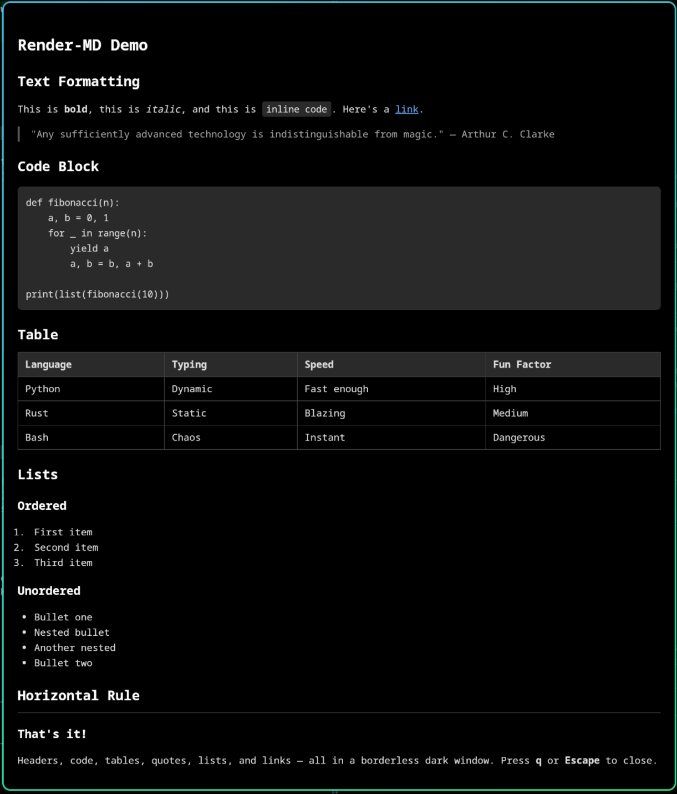

# render-md

A minimal, borderless markdown viewer for Linux. Renders markdown files in a dark-themed, floating window using GTK and WebKit. Press `q` or `Escape` to close.



## Features

- Borderless, floating window — great for overlay/popup use
- Dark theme with monospace font
- Fenced code blocks with syntax styling
- Tables, blockquotes, lists, links
- Inline images with automatic scaling based on image count
- Resolves relative image paths from the markdown file's directory

## Dependencies

- Python 3
- GTK 3 (`gi` — GObject Introspection)
- WebKit2 4.1 (`gi` — WebKit2)
- [python-markdown](https://python-markdown.github.io/)

### Arch Linux / CachyOS

```bash
sudo pacman -S python-markdown python-gobject webkit2gtk-4.1
```

### Debian / Ubuntu

```bash
sudo apt install python3-markdown python3-gi gir1.2-webkit2-4.1
```

### Fedora

```bash
sudo dnf install python3-markdown python3-gobject webkit2gtk4.1
```

## Install

Copy the script somewhere on your `$PATH`:

```bash
cp render-md ~/.local/bin/
chmod +x ~/.local/bin/render-md
```

## Usage

```bash
render-md document.md
```

Press **q** or **Escape** to quit.

### Compositor window rules

render-md works best as a floating window. The window title is `render-md` and the application ID is `com.github.render-md`.

**Hyprland** example:

```ini
windowrule {
    match:class = ^(com\.github\.render-md|render-md)$
    float = on
    size = 80% 90%
    move = 10% 5%
}
```

**Sway** example:

```ini
for_window [app_id="com.github.render-md"] floating enable, resize set 80ppt 90ppt
```

### Piping from other tools

render-md reads a file path, so write to a temp file first:

```bash
echo "# Hello" > /tmp/note.md && render-md /tmp/note.md
```

## Image scaling

When displaying images, render-md automatically adjusts the maximum image size based on how many images are in the document:

| Images | Max size |
|--------|----------|
| 0–1    | 1280x800 |
| 2–4    | 640x400  |
| 5+     | 420x260  |

## License

MIT
